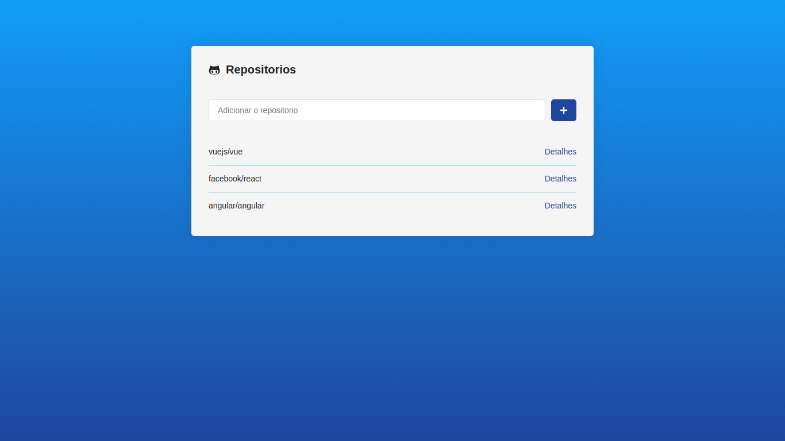
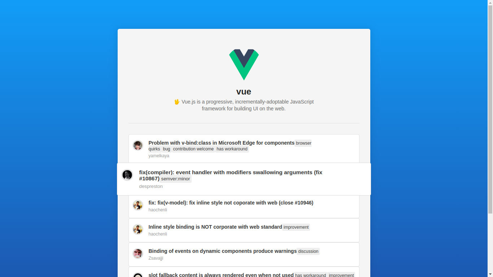

<h1 align="center"> 
  <br> :stars: React js app consumindo api do github :stars: <br> 
</h1>|

## Introdução

Objetivo aprender a trabalhar com reactjs criando um frontend que consuma a api do github.
```
nesse link: https://reactjsconsumingithubrestapi.herokuapp.com/
```

### Tela principal
Aqui você pode inserir um repositorio e ele ficara salvo no seu navegador.


### Tela do repositorio
Ao clicar no repositorio você podera ver as issues dele e suas labels.

